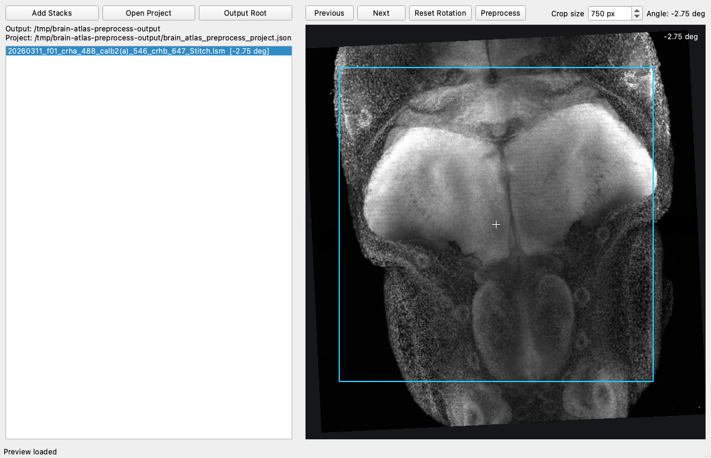

# Brain Atlas Preprocessing App

Desktop app for reviewing Zeiss `.lsm` imaging stacks before registration. It loads a selected bridge-channel maximum-intensity projection, lets you choose an approximate XY rotation and square crop, then exports preprocessed channel stacks with metadata.



## Install

The app requires Python `>=3.10`.

```bash
python -m venv .venv
source .venv/bin/activate
python -m pip install --upgrade pip
python -m pip install -e .
```

Launch the desktop app:

```bash
brain-atlas-preprocess
```

Launch the registered atlas viewer:

```bash
brain-atlas-viewer
```

For development and tests, install the test extras:

```bash
python -m pip install -e ".[test]"
pytest
```

Benchmark tooling is optional:

```bash
python -m pip install -e ".[bench]"
```

## Registered Atlas Viewer

The atlas viewer is separate from the preprocessing app and lives in `brain_atlas_viewer/`.
It serves registered NRRD channels from an `observed_channel_transform_manifest.csv`
run directory as an orthogonal slice browser. The historical script path still works:

```bash
python scripts/registered_atlas_viewer.py
```

## Basic Workflow

1. Click **Add Stacks** and select one or more Zeiss `.lsm` files.
2. Click **Output Root** and choose the folder where project state and exports should be written.
3. Select a stack in the file list and wait for the bridge-channel preview to load.
4. Right-drag in the preview to set the approximate XY rotation.
5. Left-click in the preview to set the square crop center.
6. Adjust **Crop size** if the default `750 px` crop is not appropriate.
7. Use **Prev Channel** / **Next Channel** or `a` / `d` to choose the stack's bridge channel; use `q` / `e` to move between stacks.
8. Click **Preprocess** to export the project files.

Raw `.lsm` files are read-only. The app saves review state as you work once an output root is selected.

## Outputs

The selected output root contains the project state file:

```text
brain_atlas_preprocess_project.json
```

Each processed source stack gets its own export folder:

```text
<source_stem>_preprocessed/
```

The export folder contains:

- `<source_stem>_<safe_gene>_<wavelength>nm_preprocessed.nrrd` for each exported channel.
- `preprocess_manifest.json` with source metadata, rotation, crop, channel, and output file details.
- `preprocess_qc_dapi_mip.png`, a quick bridge-channel max-projection QC image of the final rotated and cropped stack.

NRRD headers include source/channel/spatial metadata. The manifest and NRRD headers record both `rotation_degrees`, the angle shown in the app preview, and `applied_rotation_degrees`, the array rotation used during export.

Use `preprocess_qc_dapi_mip.png` as the quick visual check in FIJI/ImageJ. The filename is retained for compatibility, while the image content follows the selected bridge channel. Existing export folders need to be regenerated to get the latest NRRD headers and QC image.

## Tests

Run the test suite from the repository root:

```bash
pytest
```
